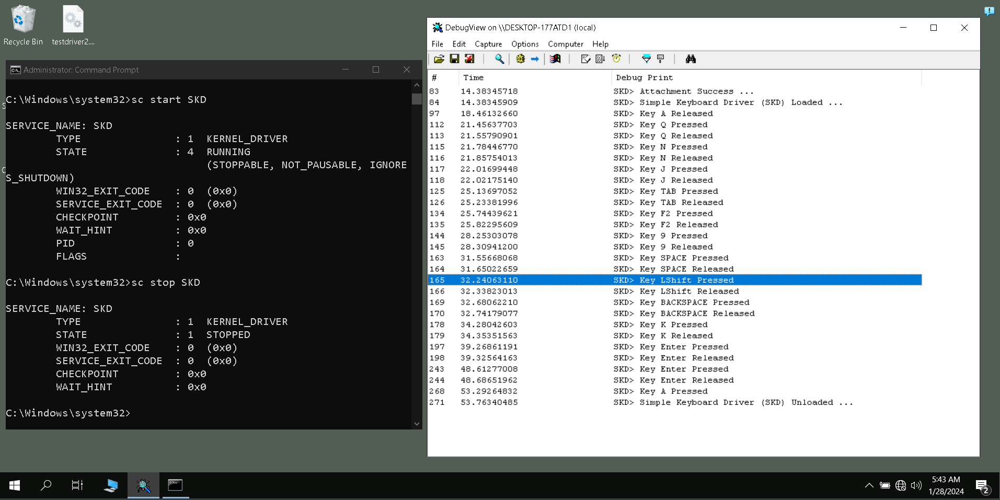

# Simple Keyboard Driver


## Description
There is Simple kernel keyboard driver for Windows which can detect which keyboard keys at kernel level.



Developed by [Amirhossein Naseri](https://www.linkedin.com/in/theahnaseri/)


## Getting Started

### Dependencies
You must install MSVC tools to build the driver, SDK and [WDK (Windows Driver Kit)](https://learn.microsoft.com/en-us/windows-hardware/drivers/download-the-wdk) to use kernel driver libraries.

### Building
Build with Microsoft Visual C++ (MVSC).


### Installing
To make windows load the driver must to reboot windows in a special mode that ignores signatures on the driver:

1. Open the start menu and the open power menu.

3. Hold shift while pressing restart.

4. Now go to `Troubleshoot>Advanced options>Startup Settings` and then press Restart.

5. When Startup Settings loaded press `7` to Disable driver signature enforcement.

6. After doing that again your Windows boot.

After rebooting Windows with driver signature checking disabled you must load the driver.
So for this you must open terminal as Administrator in your `SimpleKeyboardDriver.sys` folder.

Now to load the driver use `SC create` command to create a new service
```cmd
SC create
```

and then named your driver for example `SimpleKeyboardDriver`.
```cmd
SC create SimpleKeyboardDriver
```

after that specify the bin path to be the path to the `SimpleKeyboardDriver.sys` file.
```cmd
SC create SimpleKeyboardDriver binPath="C:\Users\user\Desktop\SimpleKeyboardDriver.sys"
```

and the type is going to be Kenel
```cmd
SC create SimpleKeyboardDriver binPath="C:\Users\user\Desktop\SimpleKeyboardDriver.sys" type=kernel
```


### Loading
Befor start your driver open [Dbgview.exe](https://live.sysinternals.com/dbgview64.exe) as Administrator. Dbgview is one of the sysinternals tools.
After open Dbgview go to Capture and enable Capture Kernel and Enable Verbose Kernel Output.

Now clear Dbgview output with `CTRL+X` start the driver:
```cmd
sc start SimpleKeyboardDriver
```
Now your driver run in Kernel and if you want to stop that:
```cmd
sc stop SimpleKeyboardDriver
```

Also you can delete driver service:
```cmd
sc delete SimpleKeyboardDriver
```


## Acknowledgments

+ [Windows-driver-samples](https://github.com/microsoft/Windows-driver-samples/tree/main/input/kbfiltr)

+ [Understanding the Windows I/O System](https://www.microsoftpressstore.com/articles/article.aspx?p=2201309&seqNum=3)

+ [Key Scan Codes](https://learn.microsoft.com/en-us/previous-versions/visualstudio/visual-studio-6.0/aa299374(v=vs.60)?redirectedfrom=MSDN)

+ [KEYBOARD_INPUT_DATA structure](https://learn.microsoft.com/en-us/windows/win32/api/ntddkbd/ns-ntddkbd-keyboard_input_data?redirectedfrom=MSDN)
